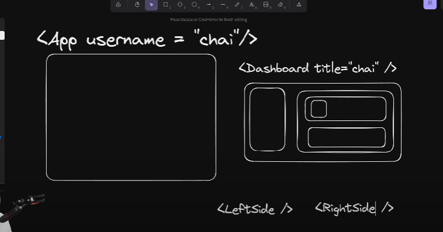
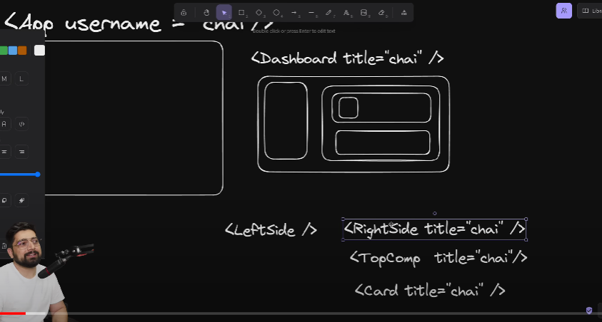

Prop Drilling

Let us say, we have an App and we want to pass data from the app into a card. The card is located in a dashboard inside several components, how will you pass data from the App to the card now?

A general way is to use "props". 
use the prop: username = "chai" in the App.

In the dashboard there are 2 components: LeftSide, RightSide.

Inside rightside, there are 2 components, TopComp and BottomComp.

Our card component is inside the TopComp, say it is called, CardComp.

Now to pass data from App to CardComp, we have to pass prop (username = "chai")
in Dashboard, RightSide, TopComp and CardComp

eg. 

<App username = "chai" /> => <Dashboard title = "chai" /> => <RightSide title = "chai" /> => <TopComp title = "chai" /> => <CardComp title = "chai" />

But when we look closely, the RightSide and the TopComp did not need to have this prop of title = "chai". But we have to do it to "pass the data further on".

So to get data inside this card component, we had to pass props inside props and so on, till we reached our desired prop and passed data to it to display.

This is therefore an "inefficient way of doing things".

To resolve this issue, we make a global object, and include our "title = "chai"" there.  

Also we tell the App to pass the data to this global object file instead of writing it in prop form. 

This allows us to remove the prop from all the components (App, Dashboard, RightSide, TopComp and CardComp). 

With this technique, we can tell App to pass prop data to the global object file and from this file, the CardComp takes in the data.

🛑🛑🛑🛑 This whole Concept is called "PROP DRILLING" 🛑🛑🛑🛑

Now to implement this global file method (State Management Method), there are many libraries which can help us:

- Context API (for React.js)
- Redux (Does State Management, i.e. organize the data that is passing from one place to another)

Redux is a standalone library, but for react, we have something called "reactRedux". 

Another easier version of redux being used nowadays is called "Redux Toolkit", aka "RTK"

- Zustand

