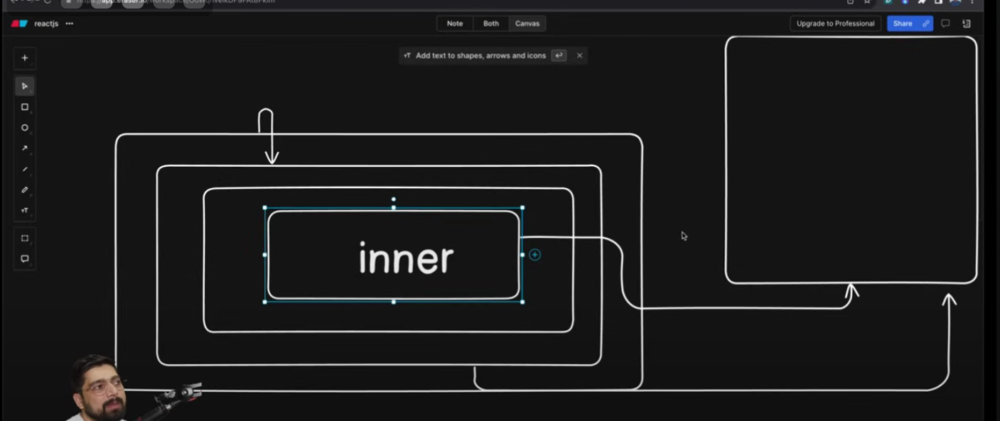

*Redux* is an independent state management library.

To use Redux with react, we use something called 'React-Redux'.

Context-API Working: 

Context API was nice but with a few shortcomings, one of them was "Data Flow".

## Data Flow 
Data Flow means how the Data goes into the Store, gets updated, and when we want to take in values from the store, and use it, it comes back to us smoothly.
So this mechanism of using data in a structured manner is called "Data Flow".

In Context API this data flow was not that smooth, say in the last todo project when we wanted to update a  todo, we first spread all the previous array elements using ...todos and then updated our message.

What if we forget to spread it? We would have overwritten the entire array data.

So to solve this problem came *flux*. But the Data Flow of *Flux* was also not that good and strong since it was a new library.

So in 2015, came *Redux* to solve this issue.
Some key points of this are:

1. Never Modify you State (State Should be read-only)
2. Changes made in the store should only be via functions (aka *Reducers*) 

Redux can also be used with other libraries like Vue other than React, hence you see in the heading of Redux documentation:

Redux:
A Predictable State Container for "JS" Apps

Notice "JS" Apps and not "React" Apps.

Now after coming of Redux came some other additional redux terminologies like Redux Thunks, Redux Middlewares, Redux Saga. All of which had their own problems and issues (like it took a long time and a complicated process to set all of this up). 

So came a modified version of Redux (called Redux Toolkit).

Redux toolkit was "Battries Included" meaning:

1. No need to set up multiple things
2. Gives a simple flow.
3. User manages multiple things internally.

We get the following benefits from Redux toolkit:
1. More Abstraction
2. Easier Ways to create stores (Earlier people used to copy and paste some snippets for this).
3. Built In Middlewares
4. Slicing (how to handle and keep Reducers) 

Some of the Redux Thunk type middlewares are already included in this Redux Toolkit.

// Redux History Done

Some concepts regarding Redux and Redux Toolkit:

- Store - Store is a type of global variable where we can take things from a single source of truth.

Now there are many types of mini-stores, like Auth Store, Product Store etc. inside the main store.  

- Reducers - These help us in making changes in these mini stores. They are like functions which help us to make changes in the store.

- useSelector - When we want to select something from the store, we use this.

- useDispatch - When we want to dispatch something from the store, we use this.

### To use redux follow these 2 commands:

1. `npm install @reduxjs/toolkit`
2. `npm install react-redux`

- Finally check with `npm run dev` if it runs correctly or not.
